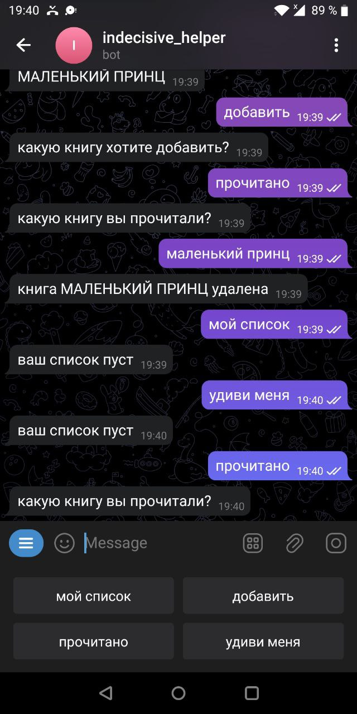

# TELEGRAM BOT для нерешительных людей 

# Содержание
1. [Описание проекта](#Описание)
2. [Требования для запуска](#Launch)
3. [Структура приложения](#Structure)
4. [Описание схожего проекта без вспомогательной библиотеки](#AttachedProject)
5. [Описание следующих шагов](#NextSteps)

## Описание

Написать телеграм бот, который бы принимал книги для последующего прочтения, и предлагал 
вариант выбрать в любой момент по желанию пользователя книгу из сохраненного списка псевдослучайным образом 
(чтобы пользователю не нужно было решать, какую книгу он хочет читать далее).

Текущие ограничения на названия книг:
* Нет контроля нам языком и символами, предполагается что пользователь отвественен за ввод;
* Нет ограничения на только ввод букв, так как существуют книги только из цифр (пример: "1984" Дж. Оруэлла);
* Нет контроля на количество слов в названии книги;

Сервис использует библиотеку https://github.com/go-telegram-bot-api/telegram-bot-api для упрощенной работы с Telegram API
(но также есть начальная реализацию сервиса через прямую работу с Telegram API ( [Описание схожего проекта без вспомогательной библиотеки](#AttachedProject))).

Доступные команды:
* **добавить** - для сохранения книги в список;
* **прочитано** - для удаления книги из списка;
* **мой список** - для вывода текущего списка;
* **удиви меня** - для выбора псевдослучайной книги;

Предполагается что вводится команда и в следующем сообщении вводится название книги, если введена сразу другая команда,
а затем название книги, то будет применена последняя из введенных команд (за этим следит `Tracker`).



## Launch

1. Для работы бота необходимо установить API токен бота в переменную окружения `TELEGRAM_APITOKEN`.
2. Также необходимо запустить `Redis` на `localhost` и порту 6379.

## Structure
```

├── cmd
│   └── main.go // запуск приложения
├── go.mod
├── go.sum
├── internal
│   ├── config 
│   │   └── config.go // конфигурация приложения
│   ├── storage
│   │   ├── redis
│   │   │   └── redis.go // реализация интерфейса для redis
│   │   └── storage.go // описание интерфейса хранения 
│   ├── telegram
│   │   ├── bot.go
│   │   ├── commands.go // обработка комманд
│   │   ├── handlers.go // обработка сообщений
│   │   └── unify.go // уницикация названий
│   └── tracker
│       └── tracker.go // хранение предыдущих команд
└── README.md
```

## AttachedProject

Предшествующий проект, но с прямой работой с telegram API https://github.com/h3ll0kitt1/tg_bot_for_indecisive.

В проекте делались соответсвующие GET и POST запросы на `https://api.telegram.org/bot + <token> + </sendMessage|/getUpdates>`
И также парсились ответные json с помощью встроенное go пакета - `encoding/json`.

Идея проектов была идентична. 

```go

func SendMessageToChat(u UpdatesResponse, token string) (string, error) {

	baseURL := pathAPI + token + "/sendMessage"

	resp, err := http.PostForm(baseURL, url.Values{
		"chat_id": {strconv.Itoa(u.Result[0].Message.Chat.Id)},
		"text":    {u.Result[0].Message.Text},
	})
	if err != nil {
		return "", fmt.Errorf("POST request to chat: %w", err)
	}

	defer resp.Body.Close()

	if resp.StatusCode != http.StatusOK {
		return "", fmt.Errorf("Unexpected Status Code: %w", err)
	}

	result, err := ioutil.ReadAll(resp.Body)
	if err != nil {
		return "", fmt.Errorf("Parse response: %w", err)
	}

	return string(result), nil
}

func getUpdatesFromBot(offset int, limit int, token string) (*UpdatesResponse, error) {

	baseURL, err := url.Parse(pathAPI + token + "/getUpdates")
	if err != nil {
		return nil, fmt.Errorf("URL parse: %w", err)
	}

	params := url.Values{}
	params.Add("limit", strconv.Itoa(limit))
	params.Add("offset", strconv.Itoa(offset))
	baseURL.RawQuery = params.Encode()

	resp, err := http.Get(baseURL.String())
	if err != nil {
		return nil, fmt.Errorf("GET updates: %w", err)
	}

	defer resp.Body.Close()

	if resp.StatusCode != http.StatusOK {
		return nil, fmt.Errorf("Unexpected Status Code: %w", err)
	}

	var u UpdatesResponse

	if err := json.NewDecoder(resp.Body).Decode(&u); err != nil {
		return nil, fmt.Errorf("Decode json to model: %w", err)
	}
	return &u, nil
}

```

## NextSteps

* Добавить сброс данных на диск, чтобы данные не терялись при перезагрузке сервиса, то есть сделать связку `Redis` + SQL БД;
* Добавить проверку расстояния хэмминга, чтобы сервис предложил пользователю ближашую книгу из списка, предполагая опечатку;
* Добавить подсчет дней с момента добавления книги по типу "Вам потребовалось N дней чтобы заставить себя прочитать книгу";
* Добавить ежедневные напоминания после применения команды случайного выбора книги для чтения;
* Добавить makefile и запуск в докере, чтобы не заставлять настраивать работу сервиса и его требований для запуска руками;
